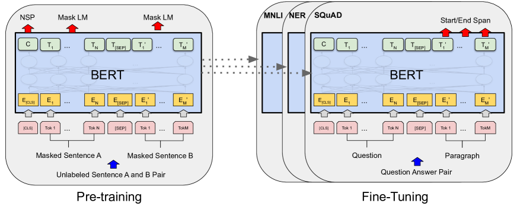
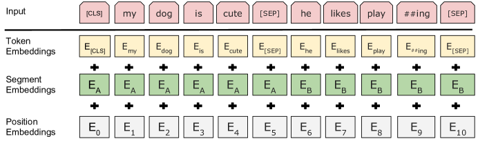

# Bert

> ***Pre-traning of Deep Bidirectional Transformers for Language Understanding***

## Abstract
BERT, which stands for Bidirectional Encoder Representations from Transformer.

Bert is designed to pre-train deep bidirectional representations from unlabeled text by jointly conditioning on both left and right context in all layers.

BERT旨在通过对所有层中的上下文进行调节，从未标记文本中预训练深度的双向表征。

也正是因为此，BERT不同于以往的语言模型，只需要增加一个额外的输出层即可对BERT模型进行微调，就可以为各种任务（例如问答、语言推理）创建最先进的模型，无需针对特定任务架构进行大量修改（without substantial task-specific architecture modifications）

All in All, BERT is conceptually simple and empirically powerfull !  BERT概念简单，实证强大

## Introduction
在此之前的一些工作，已经证明语言模型预训练可以改善许多nlp任务，并且模型需要token级细粒度的输出（fine grained output at token level）

作者还概括了，目前现有的将预训练语言模型应用于下游任务有两种现有策略，可以提前剧透一下 BERT 主要属于第二种。
1. feature-based：使用特定于任务的架构，包括预训练的表征作为额外的特征 
2. fine-tuning：引入最少特定参数（specific parameters），并在下游任务上简单的微调训练参数

这两种方法在pre-train的时候具有相同的目标函数，使用单向语言模型(unidirectional language models)来学习一般语言表示。作者大大认为单向学习限制了预训练的能力。例如OpenAI GPT，也就是老牌的Transformer，使用了一种left-to-right  architecture，每一个token的生成只能关注在先前Transformer层中存在的token，这在句子级任务（sentence-level tasks）是次优的，对于token级任务是非常有害的。

> 我的理解是上下文越短，这种自回归性质的任务，单向预训练的表现就越差

下面是重点：
In this paper, We improve the fine-tuning based approaches by proposing BERT. BERT alleviates the previously mentioned unidirectionality constraint by using a "masked language model" pre-training objective.

作者提出BERT，使用一种掩码语言模型(MLM)来缓解单向性约束，作者也指出这种表示能融合上下文（fuse the left and the right context），这能够训练双向Transformer。文章的主要贡献如下：

1. 证明双向预训练对语言表示的重要性，具体方法是掩码语言模型
2. 验证预训练表征减少了许多重工程化任务对模型特定架构的需求，展示了fine-tuning表征模型的优越性，甚至优于许多专注于特定任务的设计

## Related Work
1. Unsupervised Fearure-based Approaches

    这里作者又简单回顾了前几十年的feature-based工作，从最开始的“从头开始学习的嵌入”到词嵌入，再到后来的left-to-right context 语言建模区分正确和错误单词。这些方法已经被推广到更粗的粒度

2. Unsupervised Fine-tuning Approaches  无监督微调方法

    指的是从未标记的文本中训练出产生上下文token表征的编码器，并对下游任务进行微调。优势就是需要从头开始训练的参数很少，把不同领域问题统一成设计一个良好的自动编码器这样一个目标

3. Transfer Learning from Supervised Data 迁移学习

## BERT
终于到正文了，论文中有张图展示了预训练和微调的主要流程

1. pre-training：在不同预训练任务上基于未标记的数据进行训练
2. fine-tuning：首先使用预训练的参数初始化，然后使用来自下游任务的标记数据对所有参数进行微调，每个下游任务都有单独微调模型。

这样就可以解释上面一张图了

> A distinctive feature of BERT is its unified architecture across different tasks. There is minimal difference between the pre-trained architecture and the final downsteam architecture.

> BERT的独特之处在于其统一的架构，预训练架构与下游架构差异很小。从后半张图中也可见一斑

### Model Architecture 模型架构
多层双向Transformer编码器，其结构其实与传统的GPT Transformer架构并无很大差异。至关重要的是Bert Transformer使用bidirectional self-attention，GPT-transformer使用constrained self-attention。其实也是双向和单向的区别。

### In/Out Representations
这一小节描述的是BERT工作中对于语句token级的处理

其中input representation是由Token Embeddings、Segment Embeddings以及Position Embeddings求和来构造的。上面是可视化的结构。关于这里的每个部分作者并没有详细说明……有点可惜，不过我们大概也能猜出来，有一些特殊分类标记[CLS][SEP]表示开头和句子间区分，Segment表示术语哪一个句子。这样的设计对于接下来的预训练有什么帮助，笔者能力受限还没搞懂。

## Pre-training BERT

> we pre-train BERT using two unsupervised tasks.

### TASK #1: Masked LM

直觉得说，有理由相信深度双向模型比单向更强大，但是这种双向条件允许每个单词间接的看到其本身，这样模型就可以更轻松的预测，这实际上是不好的。
为了训练深度双向表征，可以随机屏蔽一些input token，这个过程成为“masked LM”，这里的灵感来自于前人做的完型填空任务。anyway，在这种情况下，与masked token对应的hidden vectors最终通过vocabulary送到softmax中。与自动编码器相比，BERT只预测了被masked的单词。
虽然我们这样可以通过前后文来得到双向预训练模型，但缺点是在预训练和微调之间造成了不匹配。为了[MASK]在fine-tuning期间是不会出现的，为了缓解这种情况，并不总是使用实际的[MASK] token替换"masked" word。

<!-- TODO -->
> 没看懂……问题阐释看懂了，但这种解决方案没看懂。进行token预测为什么还要替换为随机的token/不变的token。直觉来看是添加噪声？

### TASK #2：Next Sentence Prediction (NSP)
语言建模并不能理解两个句子之间的关系，至少现在不能。为了让模型理解，我们引入了next sentence prediction task。这个task的corpus可以轻松从任何单语语料库中构建。为了提取长连续序列，使用文档级的corpus而不是打乱的sentence-level的预料非常重要！！！

### Fine-tuning BERT
微调任务很直接，因为Transformer的自注意力机制允许BERT交换适当的输入输出来模拟许多下游任务。对于每个任务，只需要将输入输出插入，端到端的微调所有参数。

### Experiments and Ablation Studies
关于这些部分，其实对于我来说重点是搞懂大佬是怎么来设计实验的，实验的具体内容次之。
消融实验：
1. 依次消除task1和task2（掩码和NSP）
2. 调整模型大小 Model Size（超参数和训练步骤不变，指标还是Experiments选取的评价指标）
然后这部分再来一个总结与展望。阐述scaling law在BERT论文也是有得以体现的。

## Conclusion 
**rich, unsupervised pre-training is an integral part of many language understanding systems.**
预训练模型也能让一些低资源任务从BERT的深度架构中收益。
这篇论文的主要贡献是进一步将其推广至深度双向
